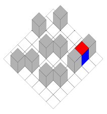

# KYUUBEY.SWF.EXE.JAR

#### TOC
TODO

# Original Description
2.44. Feladat
Egy 7 × 7 mezőből álló táblán a 46. ábrán látható módon van elhelyezve tíz
szürke kocka, valamint egy olyan kocka, amelynek öt lapja kék, a hatodik
pedig piros. A szürke kockák rögzítve vannak, ezeket nem lehet elmozdítani.
Egy lépésben a színes kockát lehet átbillenteni egy négyszomszédos üres 
mezőre. Feladatunk a színes kocka eljuttatása a C jelű mezőre úgy, hogy
a kocka piros lapja soha nem érintkezhet a tábla mezőivel.

  

### Notes
See [./devnotes.md](./devnotes.md) for developer notes.

# Development
This project uses the following branches:
- `master` (would be `1_develop`, but the repo forces `master`.)
- `2_staging`
- `3_deploy`

Development happens on the 1_develop branch (currently this is like what master is normally).
Pushes to 1_develop are automatically merged to 2_staging via a GitHub action.
Pushes to 2_staging (via the above mentioned action) trigger a `mvn test` and `mvn package` action.
(Due to rushing with the actions, the packaging is currently redundant with the next action, but also serves for testing.)
Pushes to 2_staging trigger an action which generates the javadoc, other website components, and screenshots of the game.
These are then deployed to GitHub pages via a separate repo located at [https://github.com/deliciouslytyped/szof-pg](https://github.com/deliciouslytyped/szof-pg).
The website can be accessed at [https://deliciouslytyped.github.io/szof-pg/](https://deliciouslytyped.github.io/szof-pg/).

The access to the pages repo and the branch merges are handled by permissions-limited GitHub tokens (along with the token given by default to an executing action).
These must be configured as the following secrets:
- `PUSH_TOKEN` must give write access to the current repository. (TODO: I didn't check if artifacts need separate write access.)
- `PAGES_PUSH_TOKEN` must give write access to the pages repository.

# Conventions
- No true singletons. This allows running multiple instances of the application core.

# TODO / Plan

### base
- [x] basic java build works
- [x] basic JavaFX build works
- [ ] JavaFX MVC GUI
- [ ] feladat modell
- [ ] tesztelhető / tesztek a modellhez
- [ ] perzisztens adattárolás
  - [ ] autosave/restore game
- [x] JDK 20
- [ ] logging 
  - [ ] to log file AND console

### pom
- [x] developer metadata
- [x] encoding
- [x] basic build info

### infra
- [ ] maven wrapper (`mvn wrapper:wrapper -Dtype=source -Dmaven=3.8.1`; This is the current IntelliJ Maven version.)
  [https://maven.apache.org/wrapper/](https://maven.apache.org/wrapper/)
- [ ] conventional commits
  [https://www.conventionalcommits.org/en/v1.0.0/](https://www.conventionalcommits.org/en/v1.0.0/)
(a lot of the below items are driven by CI)
- [ ] CI
 - [ ] tests
  - [ ] (unit) tests succeed
  - [x] is JARable

### (code) quality
- [ ] surefire tests
- [ ] jacoco coverage
- [ ] pmd
- [x] checkstyle
  [https://maven.apache.org/plugins/maven-checkstyle-plugin/](https://maven.apache.org/plugins/maven-checkstyle-plugin/)
- [ ] make sure paths are filtered for ascii characters
  (?: the mess on windows with people's usernames)

### portability
- [ ] resources in src/main/resources, src/test/resources,
  make sure stuff gets packaged, use relative paths (the
  isolation of the CI tests will ensure this anyway)

### site
- [ ] javadoc
  - [x] maven JXR
    [https://maven.apache.org/jxr/maven-jxr-plugin/](https://maven.apache.org/jxr/maven-jxr-plugin/)
  - [ ] package-info.java
- [ ] generated screenshots
  - [ ] scene / state select multiple screenshots
- [ ] published build artifacts / releases
  - [ ] (multiplatform JAR) (maven shade)
   - [ ] mac
   - [ ] windows
   - [ ] linux
  - [ ] graalvm binary

- [ ] score server / competitive mode

### License
This project is licensed under the [WTFPL](http://www.wtfpl.net/) to the extent possible.
