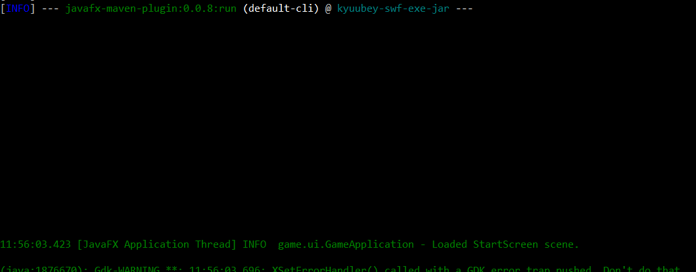

## Notes

### `-Dprism.forceGPU=true`
The machine I'm testing on seems to support OpenGL on it's X server, and it works over X11 forwarding, however,
this option needs to be bassed to JavaFX's Prism graphics engine stuff to force hardware rendering on,
because graphics cards are whitelisted or something, and JavaFX ends up disabling 3D graphics.

This option is set in `pom.xml`, as well as in Main.java for configurations where passing the argument directly may be omitted.
Since it's set in `Main.java`, anywhere else is basically redundant, but perhaps this can be improved later.

#### Finding the source of the graphics issue
https://www.google.com/search?client=firefox-b-d&q=glxgears+works+but+javafx+doesnt

https://wiki.openjdk.org/display/OpenJFX/Debug+Flags#DebugFlags-PrismVerbose

https://www.google.com/search?client=firefox-b-d&q=%22failed+graphics+hardware+qualifier+check%22
https://github.com/openjfx/javafx-maven-plugin/blob/3b0520e0d26ae6b11398f872b82088129eb4077a/src/main/java/org/openjfx/JavaFXBaseMojo.java#L143
https://maven.apache.org/guides/mini/guide-configuring-plugins.html#Mapping_Collection_Types
https://github.com/gluonhq/substrate/issues/891#issuecomment-802169710
-> https://github.com/openjdk/jfx/blob/master/modules/javafx.graphics/src/main/java/com/sun/prism/es2/X11GLFactory.java#L31
https://github.com/gluonhq/gluonfx-maven-plugin/issues/318

https://www.google.com/search?client=firefox-b-d&q=javafx+3d+platform+support
https://github.com/search?q=repo%3Aopenjdk%2Fjfx+scene3d&type=code&p=2
https://github.com/openjdk/jfx/blob/4b24c8690d01634179571d24c8919469b209bec6/modules/javafx.graphics/src/main/java/javafx/application/ConditionalFeature.java#L102
https://github.com/openjdk/jfx/blob/4b24c8690d01634179571d24c8919469b209bec6/modules/javafx.graphics/src/main/java/com/sun/javafx/tk/quantum/QuantumToolkit.java#L1224
https://github.com/openjdk/jfx/blob/4b24c8690d01634179571d24c8919469b209bec6/modules/javafx.graphics/src/main/java/com/sun/prism/es2/ES2Pipeline.java#L206
https://github.com/openjdk/jfx/blob/4b24c8690d01634179571d24c8919469b209bec6/tests/system/src/test/java/test/robot/test3d/RT35019Test.java#L57
https://www.google.com/search?client=firefox-b-d&q=java+null3d
https://github.com/jgneff/javafx-graphics/blob/master/src/javafx.graphics/classes/com/sun/prism/null3d/NULL3DPipeline.java

#### passing properties to the VM
(for figuring out how to pass the above property when using `javafx:run`)
https://www.google.com/search?q=mvn+pass+settings+to+app
https://www.google.com/search?client=firefox-b-d&q=maven+pass+properties+to+exec
https://www.google.com/search?q="javafx%3Arun"+properties
https://stackoverflow.com/questions/417152/how-do-i-set-javas-min-and-max-heap-size-through-environment-variables
https://www.google.com/search?q=configuration+systemproperties

### `no main manifest attribute`
```
$ java -jar target/original-kyuubey-swf-exe-jar-0.1.jar
no main manifest attribute, in target/original-kyuubey-swf-exe-jar-0.1.jar
```

Can be caused by running the wrong (non-uber) jar. 

```
$ DISPLAY=localhost:10.0 java -jar target/kyuubey-swf-exe-jar-0.1.jar
May 28, 2023 11:25:32 PM com.sun.javafx.application.PlatformImpl startup
WARNING: Unsupported JavaFX configuration: classes were loaded from 'unnamed module @4703afb6'
```


### It's kind of difficult to embed SVG in GitHub Markdown 
Apparently it supposed to work now but the only thing I actually got to work was like:

```html
<p align="center">
  
</p>
```
People were saying something like `img` tags don't have XSS issues, so this is probably why this worked, but I don't know why the normal Markdown image embed didn't.
TODO: I may have accidentally just used normal link syntax?

Also it's unclear when CSS/other stuff is or isn't allowed, because I wasn't able to get `div` tags to work, but the img embed above has a width style.

https://stackoverflow.com/questions/46381436/github-svg-not-rendering-at-all/46381586#46381586
https://stackoverflow.com/questions/13808020/include-an-svg-hosted-on-github-in-markdown/16462143#16462143
https://stackoverflow.com/questions/13808020/include-an-svg-hosted-on-github-in-markdown/21521184#21521184
https://stackoverflow.com/questions/13808020/include-an-svg-hosted-on-github-in-markdown
https://www.google.com/search?client=firefox-b-d&q=github+readme+not+rendering+svg
https://github.com/isaacs/github/issues/316
https://rawgit.com/
https://www.google.com/search?client=firefox-b-d&q=github+private+repo+embed+svg
https://github.com/potherca-blog/StackOverflow/blob/master/question.13808020.include-an-svg-hosted-on-github-in-markdown/readme.md
https://github.com/orgs/community/discussions/22728
https://codinhood.com/nano/git/center-images-text-github-readme
https://pragmaticpineapple.com/adding-custom-html-and-css-to-github-readme/
https://www.google.com/search?client=firefox-b-d&q=git+markdown+css
https://github.github.com/gfm/

### Extracting SVG from PDF "image"
I ended up using `pdf2svg` to convert a page of the pdf, edited out a bunch of elements in Chrome's dev tools, 
(Firefox element highlighting in SVGs doesn't work for some reason even though this (https://bugzilla.mozilla.org/show_bug.cgi?id=1567087) issue is closed
and then used some random (https://boxy-svg.com/ , it's a bit obnoxious; you have to log in to export) SVG editor to fix the canvas and positioning.
I should have probably just used InkScape.

https://stackoverflow.com/questions/4120567/how-to-prevent-my-pdf-to-svg-conversion-code-from-generating-bloated-content
https://discourse.mozilla.org/t/better-svg-editing/12925/2

### Error around exec and compile (might have been 3. in misc)
I wasn't taking notes properly here so I don't remember what the exact issue was:
https://www.google.com/search?client=firefox-b-d&q=%22The+parameter+%27executable%27+is+missing+or+invalid%22
https://www.google.com/search?client=firefox-b-d&q=exec%3Ajava+classnotfoundexception
https://stackoverflow.com/questions/17458243/class-not-found-exception-with-exec-maven-plugin-when-run-on-linux

### `Could not find or load main class org.apache.maven.wrapper.MavenWrapperMain`
SSL certificate verification was broken on the test machine for some reason.
This resulted in `wget $QUIET "$wrapperUrl" -O "$wrapperJarPath" || rm -f "$wrapperJarPath"`, which is part of the `mvnw` script,
silently failing to download the Maven Wraper JAR.

(didn't help, issue is too obscure in hindsight) https://www.google.com/search?client=firefox-b-d&q=%22Could+not+find+or+load+main+class+org.apache.maven.wrapper.MavenWrapperMain%22
https://www.google.com/search?client=firefox-b-d&q=ubuntu+certificates+broken
https://www.google.com/search?client=firefox-b-d&q=ubuntu+reinstall+certificates
https://www.google.com/search?q=ubuntu+20.04+"Unable+to+locally+verify+the+issuer's+authority."

This is what actually fixed it:
https://askubuntu.com/questions/1075780/wget-fails-by-a-certificate-problem/1331305#1331305
`sudo ln -s  /etc/ssl/certs/ca-certificates.crt /usr/local/ssl/cert.pem`

### The IntelliJ Maven version
It's listed in the settings window, if you search maven in it.

https://www.google.com/search?client=firefox-b-d&q=intellij+maven+version

### Maven wrapper without binaries
`mvn wrapper:wrapper -Dtype=script`

NOTE: apparently the wrapper explanatory page is different from the wrapper plugin page...would be nice fof the latter also linked back to the former.
https://maven.apache.org/wrapper/
https://maven.apache.org/wrapper/maven-wrapper-plugin/usage.html

### Merging in shallow clones or something errors with cant merge unrelated histories
I don't have any errors for this offhand anymore, when doing merges in github actions, `git fetch --unshallow` _is_ needed other wise you have to use --allow-unrelated histories, but that's /wrong/ in this case.

### Poking Log4J with system properties
TODO complex data structures geting stringified without pretty-printing yields unwieldy output. Since there is no way to get the structured data (youre using toString as the interface), can slf4j use some kind of post-processor to try to pretty the string it gets?
TODO is there a way to as a user decrease the log level?
https://stackoverflow.com/questions/4598702/dynamically-changing-log4j-log-level
https://stackoverflow.com/questions/1725958/how-do-you-change-a-packages-log-level-using-log4j

TODO what is disableansi for?
https://stackoverflow.com/questions/21979699/log4j-2-adding-multiple-colors-to-console-appender

TODO OK I am just not getting where I want here, this section is a mess.
`WARN StatusLogger No Log4j 2 configuration file found. Using default configuration (logging only errors to the console), or user programmatically provided configurations. Set system property 'log4j2.debug' to show Log4j 2 internal initialization logging. See https://logging.apache.org/log4j/2.x/manual/configuration.html for instructions on how to configure Log4j 2
D`
However, this doesn't seem to do any more than `-Dlog4j.debug=true`?

```
WARN StatusLogger No Log4j 2 configuration file found. Using default configuration (logging only errors to the console), or user programmatically provided configurations. Set system property 'log4j2.debug' to s>DEBUG StatusLogger PluginManager 'Lookup' found 16 plugins
DEBUG StatusLogger PluginManager 'Converter' found 45 plugins
DEBUG StatusLogger Starting OutputStreamManager SYSTEM_OUT.false.false-2
DEBUG StatusLogger null null initializing configuration org.apache.logging.log4j.core.config.DefaultConfiguration@70b0b186
DEBUG StatusLogger PluginManager 'Core' found 130 plugins
DEBUG StatusLogger PluginManager 'Level' found 0 plugins
DEBUG StatusLogger Configuration org.apache.logging.log4j.core.config.DefaultConfiguration@70b0b186 initialized
DEBUG StatusLogger Starting configuration org.apache.logging.log4j.core.config.DefaultConfiguration@70b0b186
DEBUG StatusLogger Started configuration org.apache.logging.log4j.core.config.DefaultConfiguration@70b0b186 OK.
TRACE StatusLogger Stopping org.apache.logging.log4j.core.config.DefaultConfiguration@37374a5e...
TRACE StatusLogger DefaultConfiguration notified 1 ReliabilityStrategies that config will be stopped.
TRACE StatusLogger DefaultConfiguration stopping root LoggerConfig.
TRACE StatusLogger DefaultConfiguration notifying ReliabilityStrategies that appenders will be stopped.
TRACE StatusLogger DefaultConfiguration stopping remaining Appenders.
DEBUG StatusLogger Shutting down OutputStreamManager SYSTEM_OUT.false.false-1
DEBUG StatusLogger OutputStream closed
DEBUG StatusLogger Shut down OutputStreamManager SYSTEM_OUT.false.false-1, all resources released: true
DEBUG StatusLogger Appender DefaultConsole-1 stopped with status true
TRACE StatusLogger DefaultConfiguration stopped 1 remaining Appenders.
TRACE StatusLogger DefaultConfiguration cleaning Appenders from 1 LoggerConfigs.
DEBUG StatusLogger Stopped org.apache.logging.log4j.core.config.DefaultConfiguration@37374a5e OK
TRACE StatusLogger Reregistering MBeans after reconfigure. Selector=org.apache.logging.log4j.core.selector.ClassLoaderContextSelector@1bd4fdd
TRACE StatusLogger Using default SystemClock for timestamps.
DEBUG StatusLogger org.apache.logging.log4j.core.util.SystemClock does not support precise timestamps.
TRACE StatusLogger Using DummyNanoClock for nanosecond timestamps.
DEBUG StatusLogger Reconfiguration complete for context[name=Default] at URI NULL_SOURCE (org.apache.logging.log4j.core.LoggerContext@6b0c2d26) with optional ClassLoader: null
DEBUG StatusLogger Shutdown hook enabled. Registering a new one.
DEBUG StatusLogger LoggerContext[name=Default, org.apache.logging.log4j.core.LoggerContext@6b0c2d26] started OK.
[snip]
DEBUG StatusLogger Stopping LoggerContext[name=Default, org.apache.logging.log4j.core.LoggerContext@6b0c2d26]
DEBUG StatusLogger Stopping LoggerContext[name=Default, org.apache.logging.log4j.core.LoggerContext@6b0c2d26]...
TRACE StatusLogger Unregistering but no MBeans found matching 'org.apache.logging.log4j2:type=Default'
TRACE StatusLogger Unregistering but no MBeans found matching 'org.apache.logging.log4j2:type=Default,component=StatusLogger'
TRACE StatusLogger Unregistering but no MBeans found matching 'org.apache.logging.log4j2:type=Default,component=ContextSelector'
TRACE StatusLogger Unregistering but no MBeans found matching 'org.apache.logging.log4j2:type=Default,component=Loggers,name=*'
TRACE StatusLogger Unregistering but no MBeans found matching 'org.apache.logging.log4j2:type=Default,component=Appenders,name=*'
TRACE StatusLogger Unregistering but no MBeans found matching 'org.apache.logging.log4j2:type=Default,component=AsyncAppenders,name=*'
TRACE StatusLogger Unregistering but no MBeans found matching 'org.apache.logging.log4j2:type=Default,component=AsyncLoggerRingBuffer'
TRACE StatusLogger Unregistering but no MBeans found matching 'org.apache.logging.log4j2:type=Default,component=Loggers,name=*,subtype=RingBuffer'
TRACE StatusLogger Stopping org.apache.logging.log4j.core.config.DefaultConfiguration@70b0b186...
TRACE StatusLogger DefaultConfiguration notified 1 ReliabilityStrategies that config will be stopped.
TRACE StatusLogger DefaultConfiguration stopping root LoggerConfig.
TRACE StatusLogger DefaultConfiguration notifying ReliabilityStrategies that appenders will be stopped.
TRACE StatusLogger DefaultConfiguration stopping remaining Appenders.
DEBUG StatusLogger Shutting down OutputStreamManager SYSTEM_OUT.false.false-2
DEBUG StatusLogger OutputStream closed
DEBUG StatusLogger Shut down OutputStreamManager SYSTEM_OUT.false.false-2, all resources released: true
DEBUG StatusLogger Appender DefaultConsole-2 stopped with status true
TRACE StatusLogger DefaultConfiguration stopped 1 remaining Appenders.
TRACE StatusLogger DefaultConfiguration cleaning Appenders from 1 LoggerConfigs.
DEBUG StatusLogger Stopped org.apache.logging.log4j.core.config.DefaultConfiguration@70b0b186 OK
```

```
DEBUG StatusConsoleListener null null initializing configuration XmlConfiguration[location=jar:file:/home/user/java/work/homework-project-deliciouslytyped/target/kyuubey-swf-exe-jar-0.1.jar!/log4j2.xml]
DEBUG StatusConsoleListener PluginManager 'Core' found 130 plugins
DEBUG StatusConsoleListener PluginManager 'Level' found 0 plugins
DEBUG StatusConsoleListener PluginManager 'Lookup' found 16 plugins
DEBUG StatusConsoleListener Building Plugin[name=layout, class=org.apache.logging.log4j.core.layout.PatternLayout].
DEBUG StatusConsoleListener PluginManager 'TypeConverter' found 26 plugins
DEBUG StatusConsoleListener PatternLayout$Builder(pattern="%highlight{%d{HH:mm:ss.SSS} [%t] %-5level %logger{36} - %m%n}", PatternSelector=null, Configuration(jar:file:/home/user/java/work/homework-project-deliciouslytyped/target/kyuubey-swf-exe-jar-0.1.jar!/log4j2.xml), Replace=null, charset="null", alwaysWriteExceptions="null", disableAnsi="null", noConsoleNoAnsi="null", header="null", footer="null")
DEBUG StatusConsoleListener PluginManager 'Converter' found 45 plugins
DEBUG StatusConsoleListener Building Plugin[name=appender, class=org.apache.logging.log4j.core.appender.ConsoleAppender].
DEBUG StatusConsoleListener ConsoleAppender$Builder(target="null", follow="null", direct="null", bufferedIo="null", bufferSize="null", immediateFlush="null", ignoreExceptions="null", PatternLayout(%highlight{%d{HH:mm:ss.SSS} [%t] %-5level %logger{36} - %m%n}), name="STDOUT", Configuration(jar:file:/home/user/java/work/homework-project-deliciouslytyped/target/kyuubey-swf-exe-jar-0.1.jar!/log4j2.xml), Filter=null, ={})
DEBUG StatusConsoleListener Starting OutputStreamManager SYSTEM_OUT.false.false
DEBUG StatusConsoleListener Building Plugin[name=appenders, class=org.apache.logging.log4j.core.config.AppendersPlugin].
DEBUG StatusConsoleListener createAppenders(={STDOUT})
DEBUG StatusConsoleListener Building Plugin[name=AppenderRef, class=org.apache.logging.log4j.core.config.AppenderRef].
DEBUG StatusConsoleListener createAppenderRef(ref="STDOUT", level="null", Filter=null)
DEBUG StatusConsoleListener Building Plugin[name=root, class=org.apache.logging.log4j.core.config.LoggerConfig$RootLogger].
DEBUG StatusConsoleListener LoggerConfig$RootLogger$Builder(additivity="null", level="ERROR", levelAndRefs="null", includeLocation="null", ={STDOUT}, ={}, Configuration(jar:file:/home/user/java/work/homework-project-deliciouslytyped/target/kyuubey-swf-exe-jar-0.1.jar!/log4j2.xml), Filter=null)
DEBUG StatusConsoleListener Building Plugin[name=loggers, class=org.apache.logging.log4j.core.config.LoggersPlugin].
DEBUG StatusConsoleListener createLoggers(={root})
DEBUG StatusConsoleListener Configuration XmlConfiguration[location=jar:file:/home/user/java/work/homework-project-deliciouslytyped/target/kyuubey-swf-exe-jar-0.1.jar!/log4j2.xml] initialized
DEBUG StatusConsoleListener Starting configuration XmlConfiguration[location=jar:file:/home/user/java/work/homework-project-deliciouslytyped/target/kyuubey-swf-exe-jar-0.1.jar!/log4j2.xml]
DEBUG StatusConsoleListener Started configuration XmlConfiguration[location=jar:file:/home/user/java/work/homework-project-deliciouslytyped/target/kyuubey-swf-exe-jar-0.1.jar!/log4j2.xml] OK.
DEBUG StatusConsoleListener Shutting down OutputStreamManager SYSTEM_OUT.false.false-1
DEBUG StatusConsoleListener OutputStream closed
DEBUG StatusConsoleListener Shut down OutputStreamManager SYSTEM_OUT.false.false-1, all resources released: true
DEBUG StatusConsoleListener Appender DefaultConsole-1 stopped with status true
DEBUG StatusConsoleListener Stopped org.apache.logging.log4j.core.config.DefaultConfiguration@45820e51 OK
DEBUG StatusConsoleListener org.apache.logging.log4j.core.util.SystemClock does not support precise timestamps.
DEBUG StatusConsoleListener Reconfiguration complete for context[name=Default] at URI jar:file:/home/user/java/work/homework-project-deliciouslytyped/target/kyuubey-swf-exe-jar-0.1.jar!/log4j2.xml (org.apache.logging.log4j.core.LoggerContext@40cb8df7) with optional ClassLoader: null
DEBUG StatusConsoleListener Shutdown hook enabled. Registering a new one.
DEBUG StatusConsoleListener LoggerContext[name=Default, org.apache.logging.log4j.core.LoggerContext@40cb8df7] started OK.

```
https://logging.apache.org/log4j/2.x/manual/configuration.html#StatusMessages
```
Troubleshooting tip for the impatient:

From log4j-2.9 onward, log4j2 will print all internal logging to the console if system property log4j2.debug is either defined empty or its value equals to true (ignoring case).

Prior to log4j-2.9, there are two places where internal logging can be controlled:

    Before a configuration is found, status logger level can be controlled with system property org.apache.logging.log4j.simplelog.StatusLogger.level.
    After a configuration is found, status logger level can be controlled in the configuration file with the "status" attribute, for example: <Configuration status="trace">.
```

If the xml config is set up (with lower log level - downgrading level after the fact doesnt seem to work?), this works:
`java -Dlog4j.debug=false -Dlog4j.simplelog.StatusLogger.level=trace -jar ...`
This as well: ` java -Dorg.apache.logging.log4j.simplelog.StatusLogger.level=trace -jar`
Note the `<Configuration status="error">` line.

I haven't gotten any variation on this to work; `java -Dlog4j.rootLogger=TRACE,stdout -Dlog4j.appender.stdout=org.apache.log4j2.ConsoleAppender -Dlog4j.appender.stdout.layout=org.apache.log4j.SimpleLayout -jar`

Ah here we go this is way up in there...
https://logging.apache.org/log4j/2.x/manual/configuration.html#system-properties

```
Note that beginning in Log4j 2.10, all system property names have been normalized to follow a consistent naming scheme. While the old property names are still supported for backwards compatibility, it is recommended to update configurations to use the new style.
...
 The following is a list of available global configuration properties. Note that these can only be set once per JVM process unlike configuration settings available in configuration files. The Property Name column contains the name used in properties files and system properties; Environment Variable for the equivalent environment variable; and Legacy Property Name for the pre-2.10 name.
```

This kinda worked, turns out I wasted some time where maven wasn't rebuilding without the XML file so the JAR still had it;
` java -Dlog4j2.debug=true -Dlog4j.defaultStatusLevel=TRACE -Dlog4j2.level=TRACE -Dlog4j2.statusLoggerLevel=TRACE `
```
log4j2.level
 Log level of the default configuration. The default configuration is used if the ConfigurationFactory could not successfully create a configuration (e.g. no log4j2.xml file was found).
```
TODO wonder how to override if an xml _does_ exist.

TODO (also note there is a book apparently), would probably help to just read the docs properly.
```
slf4j maven - Google Search
https://www.google.com/search?client=firefox-b-d&q=slf4j+maven

SLF4J Manual
https://www.slf4j.org/manual.html

SLF4J Manual
https://www.slf4j.org/manual.html#projectDep

SLF4J Manual
https://www.slf4j.org/manual.html

SLF4J FAQ
https://www.slf4j.org/faq.html

SLF4J Error Codes
https://www.slf4j.org/codes.html

SLF4J
https://www.slf4j.org/log4shell.html

jansi | Baeldung
https://www.baeldung.com/?s=jansi

How to Log to the Console in Color | Baeldung
https://www.baeldung.com/java-log-console-in-color

Logging in Spring Boot | Baeldung
https://www.baeldung.com/spring-boot-logging

Introduction to SLF4J | Baeldung
https://www.baeldung.com/slf4j-with-log4j2-logback

Maven – Introduction to build profiles
https://maven.apache.org/guides/introduction/introduction-to-profiles.html

jansi/AnsiConsole.java at jansi-1.4 · fusesource/jansi · GitHub
https://github.com/fusesource/jansi/blob/jansi-1.4/src/main/java/org/fusesource/jansi/AnsiConsole.java

"slf4j" "windows" "jansi" "profile" "pom" "maven" - Google Search
https://www.google.com/search?q=%22slf4j%22+%22windows%22+%22jansi%22+%22profile%22+%22pom%22+%22maven%22&client=firefox-b-d&source=lnt&tbs=li:1&sa=X&ved=2ahUKEwjruqWm95v_AhVZnf0HHSk5BQcQpwV6BAgBECA&biw=1536&bih=778&dpr=1.25

Windows console with ANSI colors handling - Super User
https://superuser.com/questions/413073/windows-console-with-ansi-colors-handling

Maven Repository: org.apache.logging.log4j » log4j-slf4j-impl
https://mvnrepository.com/artifact/org.apache.logging.log4j/log4j-slf4j-impl

Level (SLF4J 2.0.1 API)
https://www.slf4j.org/api/org/slf4j/event/Level.html#DEBUG

Properties (Java Platform SE 8 )
https://docs.oracle.com/javase/8/docs/api/java/util/Properties.html

java - Printing an array with slf4j only prints the first element - Stack Overflow
https://stackoverflow.com/questions/39589879/printing-an-array-with-slf4j-only-prints-the-first-element

slf4j level property - Google Search
https://www.google.com/search?client=firefox-b-d&q=slf4j+level+property

java - How to change slf4j logging level - Stack Overflow
https://stackoverflow.com/questions/45997759/how-to-change-slf4j-logging-level

system property slf4j elvel - Google Search
https://www.google.com/search?client=firefox-b-d&q=system+property+slf4j+elvel

java - How to configure slf4j-simple - Stack Overflow
https://stackoverflow.com/questions/14544991/how-to-configure-slf4j-simple

Log4j – Log4j 2 SLF4J Binding
https://logging.apache.org/log4j/2.x/log4j-slf4j-impl.html

Overview (Apache Log4j API 2.20.0 API)
https://logging.apache.org/log4j/2.x/javadoc/log4j-api/index.html

log4j level property - Google Search
https://www.google.com/search?client=firefox-b-d&q=log4j+level+property

The log4j.properties file
https://docs.oracle.com/cd/E29578_01/webhelp/cas_webcrawler/src/cwcg_config_log4j_file.html

logging - How to set log level in log4j from properties file in runtime - Stack Overflow
https://stackoverflow.com/questions/14020567/how-to-set-log-level-in-log4j-from-properties-file-in-runtime

slf4j log4j "-D" - Google Search
https://www.google.com/search?q=slf4j+log4j+%22-D%22&client=firefox-b-d&ei=LGJ1ZL3eOauK9u8PwIi5sAo&ved=0ahUKEwi9pKmKgpz_AhUrhf0HHUBEDqYQ4dUDCA4&uact=5&oq=slf4j+log4j+%22-D%22&gs_lcp=Cgxnd3Mtd2l6LXNlcnAQAzIFCAAQogQyBQgAEKIEMgUIABCiBDIFCAAQogQ6BggAEBYQHjoNCAAQFhAeEA8Q8QQQCjoICAAQigUQhgM6BQghEKABOggIIRAWEB4QHToKCCEQFhAeEA8QHUoECEEYAEoFCEASATFQAFioFGDXGGgAcAF4AIABdIgB1ASSAQM1LjKYAQCgAQHAAQE&sclient=gws-wiz-serp

java - How to get SLF4J "Hello World" working with log4j? - Stack Overflow
https://stackoverflow.com/questions/4311026/how-to-get-slf4j-hello-world-working-with-log4j

Log4j – Configuring Log4j 2
https://logging.apache.org/log4j/2.x/manual/configuration.html

Log4j – Log4j 2 SLF4J Binding
https://logging.apache.org/log4j/2.x/log4j-slf4j-impl.html

Overview (Apache Log4j API 2.20.0 API)
https://logging.apache.org/log4j/2.x/javadoc/log4j-api/index.html

Log4j – Log4j to SLF4J Adapter
https://logging.apache.org/log4j/2.x/log4j-to-slf4j.html

Log4j – Configuring Log4j 2
https://logging.apache.org/log4j/2.x/manual/configuration.html

log4j2 "-D" "rootlogger" stackexchange properties - Google Search
https://www.google.com/search?q=log4j2+%22-D%22+%22rootlogger%22+stackexchange+properties&client=firefox-b-d&ei=ImR1ZI_rAvWE9u8PnqWv2Ag&ved=0ahUKEwiPhKL5g5z_AhV1gv0HHZ7SC4sQ4dUDCA4&uact=5&oq=log4j2+%22-D%22+%22rootlogger%22+stackexchange+properties&gs_lcp=Cgxnd3Mtd2l6LXNlcnAQAzIFCAAQogQyBQgAEKIEMgUIABCiBDIFCAAQogQ6CggAEEcQ1gQQsAM6BQghEKABOgcIIRCgARAKOgQIIRAVOggIIRAWEB4QHUoECEEYAFBMWNAmYKwpaAZwAXgAgAFtiAHeEpIBBDI2LjKYAQCgAQHAAQHIAQg&sclient=gws-wiz-serp

java - log4j2 properties configuration to put messages of different severities in different log files - Stack Overflow
https://stackoverflow.com/questions/48724699/log4j2-properties-configuration-to-put-messages-of-different-severities-in-diffe

log4j system properties stackexchagne - Google Search
https://www.google.com/search?client=firefox-b-d&q=log4j+system+properties+stackexchagne

java - Use system properties OR variables in log4j - Stack Overflow
https://stackoverflow.com/questions/14332525/use-system-properties-or-variables-in-log4j

java - System property not being read by log4j2 -> lo4j1 bridge - Stack Overflow
https://stackoverflow.com/questions/70628593/system-property-not-being-read-by-log4j2-lo4j1-bridge

java - log4j2.xml is not picking the changes in system properties during the runtime? - Stack Overflow
https://stackoverflow.com/questions/52515712/log4j2-xml-is-not-picking-the-changes-in-system-properties-during-the-runtime

java - log4j2 configuration using system properties - Stack Overflow
https://stackoverflow.com/questions/66639991/log4j2-configuration-using-system-properties

log4j.debug ignored - Google Search
https://www.google.com/search?client=firefox-b-d&q=log4j.debug+ignored

debug slf4j loading - Google Search
https://www.google.com/search?q=debug+slf4j+loading&client=firefox-b-d&ei=LWV1ZMTNOpGK9u8P6uyOmAo&ved=0ahUKEwiEmIL5hJz_AhURhf0HHWq2A6MQ4dUDCA4&uact=5&oq=debug+slf4j+loading&gs_lcp=Cgxnd3Mtd2l6LXNlcnAQAzIHCCEQoAEQCjIHCCEQoAEQCjIHCCEQoAEQCjIHCCEQoAEQCjoKCAAQRxDWBBCwAzoFCAAQgAQ6BggAEBYQHjoFCCEQoAFKBAhBGABQGVitCGCRCWgBcAF4AIABpwKIAf8KkgEFMC40LjOYAQCgAQHAAQHIAQg&sclient=gws-wiz-serp

SLF4J Manual
https://www.slf4j.org/manual.html


https://www.google.com/search?q="-Dlog4j.rootlogger"
https://log4j-user.logging.apache.narkive.com/Vx051m9n/override-values-from-log4j-properties-on-jvm-command-line
https://issues.apache.org/jira/browse/LOG4J2-3341
https://lists.apache.org/thread/gvfb3jkg6t11cyds4jmpo7lrswmx28w3
https://stackoverflow.com/questions/23869207/what-is-the-significance-of-log4j-rootlogger-property-in-log4j-properties-file
https://stackoverflow.com/questions/17304618/trouble-getting-log4j-to-output-to-file
https://www.google.com/search?q=log4j+rootlogger+appender
https://www.tutorialspoint.com/log4j/log4j_configuration.htm
https://logging.apache.org/log4j/2.x/manual/appenders.html
https://howtodoinjava.com/log4j2/log4j2-consoleappender-example/
https://www.google.com/search?client=firefox-b-d&q=slf4j+%22-Dlog4j.rootlogger%22
https://stackoverflow.com/questions/13935715/disabling-log4j-logs-during-maven-test-phase
https://www.google.com/search?client=firefox-b-d&q=d+flag+vs+properties+file
https://stackoverflow.com/questions/10686963/command-line-arguments-vs-file-properties-properties-vs-system-properties
https://www.google.com/search?client=firefox-b-d&q=log4j+appender+system+properties
https://logging.apache.org/log4j/2.x/manual/configuration.html
```


```
 2864  DISPLAY=localhost:10.0 java -jar target/kyuubey-swf-exe-jar-0.1.jar -Dlog4j.rootLogger=ERROR,stdout,fout
 2865  DISPLAY=localhost:10.0 java -jar target/kyuubey-swf-exe-jar-0.1.jar -Dlog4j.rootLogger=TRACE,stdout,fout
 2866  DISPLAY=localhost:10.0 java -jar target/kyuubey-swf-exe-jar-0.1.jar -Dlog4j.rootLogger=TRACE,stdout,file
 2867  DISPLAY=localhost:10.0 java -jar target/kyuubey-swf-exe-jar-0.1.jar -Dlog4j.rootLogger=TRACE,stdout,file -Dappender.stdout.type=Console
 2868  ls ../../06_slf4j-example/src/main/resources/log4j2.xml
 2869  nano ../../06_slf4j-example/src/main/resources/log4j2.xml
 2870  DISPLAY=localhost:10.0 java -jar target/kyuubey-swf-exe-jar-0.1.jar -DrootLogger=TRACE,stdout,file -Dappender.stdout.type=Console
 2871  DISPLAY=localhost:10.0 java -jar target/kyuubey-swf-exe-jar-0.1.jar -Dlog4j.rootLogger=TRACE,stdout,file -Dlog4j.appender.stdout.type=Console
 2872  DISPLAY=localhost:10.0 java -jar target/kyuubey-swf-exe-jar-0.1.jar -Dlog4j.rootLogger=TRACE,STDOUT,file -Dlog4j.appender.stdout.type=Console -Dlog4j.appender.stdout.name=STDOUT
 2873  DISPLAY=localhost:10.0 java -jar target/kyuubey-swf-exe-jar-0.1.jar -Dlog4j2.debug=true -Dlog4j.rootLogger=TRACE,STDOUT,file -Dlog4j.appender.stdout.type=Console -Dlog4j.appender.stdout.name=STDOUT
 2874  DISPLAY=localhost:10.0 java -jar target/kyuubey-swf-exe-jar-0.1.jar -Dlog4j2.debug=true e
 2875  JVM_OPTS="" DISPLAY=localhost:10.0 java -jar target/kyuubey-swf-exe-jar-0.1.jar
 2876  JVM_OPTS=" -Dlog4j2.debug=true -Dlog4j.rootLogger=TRACE,STDOUT,file -Dlog4j.appender.stdout.type=Console -Dlog4j.appender.stdout.name=STDOUT" DISPLAY=localhost:10.0 java -jar target/kyuubey-swf-exe-jar-0.1.jar
 2877  cp ../../06_slf4j-example/src/main/resources/log4j2.xml ./src/main/resources/
 2878  JVM_OPTS=" -Dlog4j2.debug=true -Dlog4j.rootLogger=TRACE,STDOUT,file -Dlog4j.appender.stdout.type=Console -Dlog4j.appender.stdout.name=STDOUT" DISPLAY=localhost:10.0 java -jar target/kyuubey-swf-exe-jar-0.1.jar
 2879  DISPLAY=localhost:10.0 java -jar target/kyuubey-swf-exe-jar-0.1.jar
 2880  java -jar target/kyuubey-swf-exe-jar-0.1.jar
 2881  java -jar target/kyuubey-swf-exe-jar-0.1.jar -Dlog4j2.debug=true
 2882  java --help -jar target/kyuubey-swf-exe-jar-0.1.jar
 2883  java -Dlog4j2.debug=true -jar target/kyuubey-swf-exe-jar-0.1.jar
 2884  rm src/main/resources/log4j2.xml
 2885  java -Dlog4j2.debug=true -jar target/kyuubey-swf-exe-jar-0.1.jar
 2886  rm src/main/resources/log4j2.xml
 2887  git status
 2888  java -Dlog4j.rootLogger=TRACE,STDOUT,file  -jar target/kyuubey-swf-exe-jar-0.1.jar
 2889  nano devnotes.md
 2890  man java
 2891  JVM_OPTS="-Dlog4j.rootLogger=TRACE,STDOUT,file " java -jar target/kyuubey-swf-exe-jar-0.1.jar
 2892  java -jar target/kyuubey-swf-exe-jar-0.1.jar
 2893  ls
 2894  java -jar target/kyuubey-swf-exe-jar-0.1.jar
 2895  env | grep log4j
 2896  ls -alh
 2897  grep -irl log4
 2898  grep -irl debug
 2899  grep -irl DEBUG
 2900  grep -irl log4j ~
 2901  grep -irl log4j ~  |& less -S
 2902  grep -irl logger
 2903  grep -irl log
 2904  nano pom.xml
 2905  nano src/main/java/game/*
 2906  nano src/main/java/game/ui/*
 2907  ls target/
 2908  tree target/
 2909  rm target/classes/log4j2.xml
 2910  java -jar target/kyuubey-swf-exe-jar-0.1.jar
 2911  tree target/
 2912  java -jar target/kyuubey-swf-exe-jar-0.1.jar
 2913  java -Dlog4j.rootLogger=TRACE,STDOUT,file  -jar target/kyuubey-swf-exe-jar-0.1.jar
 2914  DISPLAY=localhost:10.0 java -Dlog4j.rootLogger=TRACE,STDOUT,file  -jar target/kyuubey-swf-exe-jar-0.1.jar
 2915  java -Dlog4j2.rootLogger=TRACE,STDOUT,file  -jar target/kyuubey-swf-exe-jar-0.1.jar
 2916  java -Dlog4j2.rootLogger=TRACE,STDOUT,file -Dlog4j.appender.A1=org.apache.log4j.ConsoleAppender -jar target/kyuubey-swf-exe-jar-0.1.jar
 2917  java -Dlog4j.rootLogger=TRACE,STDOUT,file -Dlog4j.appender.A1=org.apache.log4j.ConsoleAppender -jar target/kyuubey-swf-exe-jar-0.1.jar
 2918  java -Dlog4j.debug=true -jar target/kyuubey-swf-exe-jar-0.1.jar
 2919  java -jar target/kyuubey-swf-exe-jar-0.1.jar -Dlog4j.debug=true
 2920  nano devnotes.md
 2921  JVM_OPTS="-Dlog4j.debug=true" java -jar target/kyuubey-swf-exe-jar-0.1.jar
 2922  JAVA_OPTS="-Dlog4j.debug=true" java -jar target/kyuubey-swf-exe-jar-0.1.jar
 2923  JAVA_TOOL_OPTIONS="-Dlog4j.debug=true" java -jar target/kyuubey-swf-exe-jar-0.1.jar
 2924  nano devnotes.md
 2925  history |& less
 2926  java -DrootLogger=TRACE,stdout -jar target/kyuubey-swf-exe-jar-0.1.jar
 2927  java -DrootLogger=TRACE -jar target/kyuubey-swf-exe-jar-0.1.jar
 2928  java -Dlog4j.rootLogger=TRACE -jar target/kyuubey-swf-exe-jar-0.1.jar
 2929  java -Dlog4j.rootLogger=TRACE,stdout -jar target/kyuubey-swf-exe-jar-0.1.jar
 2930  java -Dlog4j2.rootLogger=TRACE,stdout -jar target/kyuubey-swf-exe-jar-0.1.jar
 2931  java -Dlog4j.rootLogger=TRACE,stdout -Dlog4j.appender.A1=org.apache.log4j.ConsoleAppender -jar target/kyuubey-swf-exe-jar-0.1.jar
 2932  java -Dlog4j.rootLogger=TRACE,stdout -Dlog4j.appender.console=org.apache.log4j.ConsoleAppender -jar target/kyuubey-swf-exe-jar-0.1.jar
 2933  java -Dlog4j.rootLogger=TRACE,stdout -Dlog4j.appender.console=org.apache.log4j.ConsoleAppender -Dlog4j.appender.console.target=System.out -jar target/kyuubey-swf-exe-jar-0.1.jar
 2934  java -Dlog4j.debug=true -Dlog4j.rootLogger=TRACE,stdout -Dlog4j.appender.console=org.apache.log4j.ConsoleAppender -Dlog4j.appender.console.target=System.out -jar target/kyuubey-swf-exe-jar-0.1.jar
 2935  java -Dlog4j.debug=true -Dlog4j2.debug -Dlog4j.rootLogger=TRACE,stdout -Dlog4j.appender.console=org.apache.log4j.ConsoleAppender -Dlog4j.appender.console.target=System.out -jar target/kyuubey-swf-exe-jar-0.1.jar
 2936  nano devnotes.md
 2937  java -Dlog4j.debug=true -Dlog4j2.debug=true -Dlog4j.rootLogger=TRACE,stdout -Dlog4j.appender.console=org.apache.log4j.ConsoleAppender -Dlog4j.appender.console.target=System.out -jar target/kyuubey-swf-exe-jar-0.1.jar
 2938* java -Dlog4j2.debug=true  -jar target/kyuubey-swf-exe-jar-0.1.jar |& less -S
 2939  java -Dlog4j.debug=true -Dlog4j2.debug=true -Dlog4j.rootLogger=TRACE,stdout -Dlog4j.appender.stdout=org.apache.log4j.ConsoleAppender -Dlog4j.appender.stdout.layout=org.apache.log4j.SimpleLayout -jar target/kyuubey-swf-exe-jar-0.1.jar
 2940  java -Dlog4j.rootLogger=TRACE,stdout -Dlog4j.appender.stdout=org.apache.log4j.ConsoleAppender -Dlog4j.appender.stdout.layout=org.apache.log4j.SimpleLayout -jar target/kyuubey-swf-exe-jar-0.1.jar
 2941  DISPLAY=localhost:10.0 java -Dlog4j.rootLogger=TRACE,stdout -Dlog4j.appender.stdout=org.apache.log4j.ConsoleAppender -Dlog4j.appender.stdout.layout=org.apache.log4j.SimpleLayout -jar target/kyuubey-swf-exe-jar-0.1.jar
 2942  DISPLAY=localhost:10.0 java -Dlog4j.rootLogger=TRACE,stdout -Dlog4j.appender.stdout=org.apache.log4j.C2onsoleAppender -Dlog4j.appender.stdout.layout=org.apache.log4j.SimpleLayout -jar target/kyuubey-swf-exe-jar-0.1.jar
 2943  DISPLAY=localhost:10.0 java -Dlog4j.rootLogger=TRACE,stdout -Dlog4j.appender.stdout=org.apache.log4j.C22osoleAppender -Dlog4j.appender.stdout.layout=org.apache.log4j.SimpleLayout -jar target/kyuubey-swf-exe-jar-0.1.jar
 2944  DISPLAY=localhost:10.0 java -Dlog4j.rootLogger=TRACE,stdout -Dlog4j.appender.stdout=org.apache.log4j2.CosoleAppender -Dlog4j.appender.stdout.layout=org.apache.log4j.SimpleLayout -jar target/kyuubey-swf-exe-jar-0.1.jar
 2945  nano devnotes.md
 2946  cp ../../06_slf4j-example/src/main/resources/log4j2.xml ./src/main/resources/
 2947  nano src/main/resources/
 2948  nano src/main/resources/log4j2.xml
 2949  DISPLAY=localhost:10.0 java -Dlog4j.rootLogger=TRACE,stdout -jar target/kyuubey-swf-exe-jar-0.1.jar
 2950  java -Dlog4j.rootLogger=TRACE,stdout -jar target/kyuubey-swf-exe-jar-0.1.jar 2951  java -Dlog4j.rootLogger=ERROR,stdout -jar target/kyuubey-swf-exe-jar-0.1.jar
 2951  java -Dlog4j.rootLogger=ERROR,stdout -jar target/kyuubey-swf-exe-jar-0.1.jar
 2952  java -jar target/kyuubey-swf-exe-jar-0.1.jar
 2953  nano devnotes.md
 2954  java -jar target/kyuubey-swf-exe-jar-0.1.jar |& less -S
 2955  nano src/main/resources/log4j2.xml
 2956  nano devnotes.md
 2957  java -Dlog4j.debug=false -jar target/kyuubey-swf-exe-jar-0.1.jar |& less -S
 2958  java -Dlog4j.debug=false -Dorg.apache.logging.log4j.simplelog.StatusLogger.level=error -jar target/kyuubey-swf-exe-jar-0.1.jar |& less -S
 2959  java -Dorg.apache.logging.log4j.simplelog.StatusLogger.level=error -jar target/kyuubey-swf-exe-jar-0.1.jar |& less -S
 2960  java -Dlog4j.debug=false -Dlog4j.simplelog.StatusLogger.level=error -jar target/kyuubey-swf-exe-jar-0.1.jar |& less -S
 2961  nano src/main/resources/log4j2.xml
 2962  java -jar target/kyuubey-swf-exe-jar-0.1.jar |& less -S
 2963  java -Dlog4j.debug=false -Dlog4j.simplelog.StatusLogger.level=trace -jar target/kyuubey-swf-exe-jar-0.1.jar |& less -S
 2964  nano devnotes.md
 2965  java -Dlog4j.simplelog.StatusLogger.level=trace -jar target/kyuubey-swf-exe-jar-0.1.jar |& less -S
 2966  java -Dorg.apache.logging.log4j.simplelog.StatusLogger.level=trace -jar target/kyuubey-swf-exe-jar-0.1.jar |& less -S
 2967  java -jar target/kyuubey-swf-exe-jar-0.1.jar |& less -S
 2968  nano devnotes.md
 2969  nano src/main/resources/log4j2.xml
 2970  nano devnotes.md
 2971  ava -Dlog4j.rootLogger=TRACE -jar target/kyuubey-swf-exe-jar-0.1.jar |& less -S
 2972  java -Dlog4j.rootLogger=TRACE -jar target/kyuubey-swf-exe-jar-0.1.jar |& less -S
 2973  java -Dlog4j.rootLogger=TRACE,stdout -jar target/kyuubey-swf-exe-jar-0.1.jar
 2974  DISPLAY=localhost:10.0 java -Dlog4j.rootLogger=TRACE,stdout -Dlog4j.appender.stdout=org.apache.log4j2.CosoleAppender -Dlog4j.appender.stdout.layout=org.apache.log4j.SimpleLayout -jar target/kyuubey-swf-exe-jar-0.1.jar
 2975  DISPLAY=localhost:10.0 java -Dlog4j.rootLogger=TRACE,stdout -Dlog4j.appender.stdout=org.apache.log4j2.ConsoleAppender -Dlog4j.appender.stdout.layout=org.apache.log4j.SimpleLayout -jar target/kyuubey-swf-exe-jar-0.1.jar
 2976  nano devnotes.md
 2977  DISPLAY=localhost:10.0 java -Dlog4j.level=TRACE -jar target/kyuubey-swf-exe-jar-0.1.jar
 2978  DISPLAY=localhost:10.0 java -Dlog4j.SimpleLogLevel=TRACE -jar target/kyuubey-swf-exe-jar-0.1.jar
 2979  DISPLAY=localhost:10.0 java -Dlog4j.simplelogLevel=TRACE -jar target/kyuubey-swf-exe-jar-0.1.jar
 2980  DISPLAY=localhost:10.0 java -Dlog4j.defaultStatusLevel=TRACE -jar target/kyuubey-swf-exe-jar-0.1.jar
 2981  DISPLAY=localhost:10.0 java -Dlog4j.statusLoggerLevel=TRACE -jar target/kyuubey-swf-exe-jar-0.1.jar
 2982  rm src/main/resources/log4j2.xml
 2983  DISPLAY=localhost:10.0 java -Dlog4j.level=TRACE -jar target/kyuubey-swf-exe-jar-0.1.jar
 2984  DISPLAY=localhost:10.0 java -Dlog4j2.level=TRACE -jar target/kyuubey-swf-exe-jar-0.1.jar
 2985  DISPLAY=localhost:10.0 java -Dlog4j2.level=debug -jar target/kyuubey-swf-exe-jar-0.1.jar
 2986  DISPLAY=localhost:10.0 java -Dlog4j.statusLoggerLevel=TRACE -jar target/kyuubey-swf-exe-jar-0.1.jar
 2987  DISPLAY=localhost:10.0 java -Dlog4j.defaultStatusLevel=TRACE -Dlog4j2.level=TRACE -Dlog4j2.statusLoggerLevel=TRACE -jar target/kyuubey-swf-exe-jar-0.1.jar
 2988  find . -iname "*.xml"
 2989  rm target/classes/log4j2.xml
 2990  DISPLAY=localhost:10.0 java -Dlog4j.defaultStatusLevel=TRACE -Dlog4j2.level=TRACE -Dlog4j2.statusLoggerLevel=TRACE -jar target/kyuubey-swf-exe-jar-0.1.jar
 2991  find . -iname "*.xml"
 2992  DISPLAY=localhost:10.0 java -Dlog4j2.debug=true -Dlog4j.defaultStatusLevel=TRACE -Dlog4j2.level=TRACE -Dlog4j2.statusLoggerLevel=TRACE -jar target/kyuubey-swf-exe-jar-0.1.jar
 2993  mvn package
 2994  DISPLAY=localhost:10.0 java -Dlog4j2.debug=true -Dlog4j.defaultStatusLevel=TRACE -Dlog4j2.level=TRACE -Dlog4j2.statusLoggerLevel=TRACE -jar target/kyuubey-swf-exe-jar-0.1.jar -X
 2995  ls target/kyuubey-swf-exe-jar-0.1
 2996  ls target/kyuubey-swf-exe-jar-0.1.jar
 2997  ls -alh target/kyuubey-swf-exe-jar-0.1.jar
 2998  mvn package
 2999  DISPLAY=localhost:10.0 java -Dlog4j2.debug=true -Dlog4j.defaultStatusLevel=TRACE -Dlog4j2.level=TRACE -Dlog4j2.statusLoggerLevel=TRACE -jar target/kyuubey-swf-exe-jar-0.1.jar -X
 3000  DISPLAY=localhost:10.0 java -Dlog4j.defaultStatusLevel=TRACE -Dlog4j2.level=TRACE -Dlog4j2.statusLoggerLevel=TRACE -jar target/kyuubey-swf-exe-jar-0.1.jar -X
 3001  DISPLAY=localhost:10.0 java -Dlog4j.defaultStatusLevel=TRACE -Dlog4j2.level=TRACE jar target/kyuubey-swf-exe-jar-0.1.jar -X
 3002  DISPLAY=localhost:10.0 java -Dlog4j.defaultStatusLevel=TRACE -Dlog4j2.level=TRACE -jar target/kyuubey-swf-exe-jar-0.1.jar -X
```

### Log4j not outputting trace lines
TODO am I misremembering that terminals might have a way to detect dark / light mode?

Log4j looked like it was outputting everything except trace lines, but it was also generating a lot of what appeared to be empty lines, which I assumed had something to do with `log.trace("sysprops: {}", System.getProperties());` going wrong.


So it turns out log4j _was_ outputting .trace() lines, but since the sample xml specified highlighting; `<PatternLayout pattern="%highlight{%d{HH:mm:ss.SSS} [%t] %-5level %logger{36} - %m%n}"/>`
(See also the highlight section in: https://logging.apache.org/log4j/2.x/manual/layouts.html)
- trace lines are (unconditionally?) set to black. So with a dark color schemed terminal, log4j prints black on black lines...
You can see this by looking at the hex of the output, and you can see the ANSI control sequence `[30m` used here:
```
$ DISPLAY=:2 java -jar target/kyuubey-swf-exe-jar-0.1.jar |& xxd -c 40
00000000: 5741 524e 494e 473a 2073 756e 2e72 6566 6c65 6374 2e52 6566 6c65 6374 696f 6e2e 6765 7443 616c 6c65  WARNING: sun.reflect.Reflection.getCalle
00000028: 7243 6c61 7373 2069 7320 6e6f 7420 7375 7070 6f72 7465 642e 2054 6869 7320 7769 6c6c 2069 6d70 6163  rClass is not supported. This will impac
00000050: 7420 7065 7266 6f72 6d61 6e63 652e 0a1b 5b33 306d 3131 3a35 383a 3032 2e34 3035 205b 6d61 696e 5d20  t performance...[30m11:58:02.405 [main]
00000078: 5452 4143 4520 6761 6d65 2e4d 6169 6e20 2d20 6172 6773 3a20 7b7d 0a1b 5b6d 1b5b 3330 6d31 313a 3538  TRACE game.Main - args: {}..[m.[30m11:58
```

As specified in the above layouts link, you can change the color by appengding `{trace=...}`. Can we make it use the normal color instead of setting an explicit color?
The docs say https://logging.apache.org/log4j/2.x/log4j-core/apidocs/org/apache/logging/log4j/core/pattern/AnsiEscape.html is used for the names. There is a `NORMAL` value.
https://gist.github.com/JBlond/2fea43a3049b38287e5e9cefc87b2124 and https://en.wikipedia.org/wiki/ANSI_escape_code list 0 as reset.
Checking the source: (not in order of discovery)
https://github.com/search?q=repo%3Aapache%2Flogging-log4j2%20ansiescape&type=code
mentions createSequence : https://github.com/apache/logging-log4j2/blob/3f5da0a884a04dc9633e33e8a3250649af898927/log4j-core/src/main/java/org/apache/logging/log4j/core/pattern/HighlightConverter.java#L97
createSequence: https://github.com/apache/logging-log4j2/blob/3f5da0a884a04dc9633e33e8a3250649af898927/log4j-core/src/main/java/org/apache/logging/log4j/core/pattern/AnsiEscape.java#L445
createsequence can be seen converting the enum value name to it's value so using `normal` should be perfectly fine.
NORMAL indeed corresponds to the 0 reset: https://github.com/apache/logging-log4j2/blob/3f5da0a884a04dc9633e33e8a3250649af898927/log4j-core/src/main/java/org/apache/logging/log4j/core/pattern/AnsiEscape.java#L59
https://stackoverflow.com/questions/43539956/how-to-stop-the-effect-of-ansi-text-color-code-or-set-text-color-back-to-default

But really, changing it to any color other than black or white is probably fine I guess.

### misc
1. Get help with `help:help`, `buildplan:`
2. `help:describe -Dplugin=javafx -Dgoal=run`
3. `exec:exec` does not imply `compile` for some reason.
4. Change current git branch name with `git branch -m [oldname] newname`
5. Delete remote git branch with `git push origin -d branchname`
6. GitHub Actions usage: https://docs.github.com/en/billing/managing-billing-for-github-actions/viewing-your-github-actions-usage
7. git add all untracked files with `git add -A`
8. maven site / javadoc empirically seems to use relative paths
9. Having an ssh and a MobaXterm session open, with the latter forwarding X11 to its Xorg and the former using DISPLAY works just fine
10. cache git credentials for some time `git config --local credential.helper "cache --timeout=$((3600*4))"`
11. So far dropping into a reverse shell in GitHub Actions seems to be the best way to debug them. TODO code sample / oneliner
12. `java -jar jarname.jar` passes subsequent arguments to the jar; if you want to pass arguments to the jvm you have to do it before the jar
13. `java -Dlog4j.debug=true -jar` yields Log4j debug output
14. Sometimes launcher scripts might accept JVM_OPTS or JAVA_OPTS (TODO check), the Temurin binary taked JAVA_TOOL_OPTS; https://stackoverflow.com/questions/5241743/how-do-i-use-the-java-opts-environment-variable
15. SLF4J pitfall: varargs will eat arrays https://stackoverflow.com/questions/39589879/printing-an-array-with-slf4j-only-prints-the-first-element

#### TODO Questions
1. Is there any relationship between -D and properties files?
2. Can Log4j be configured up with -D without a configuration file?
